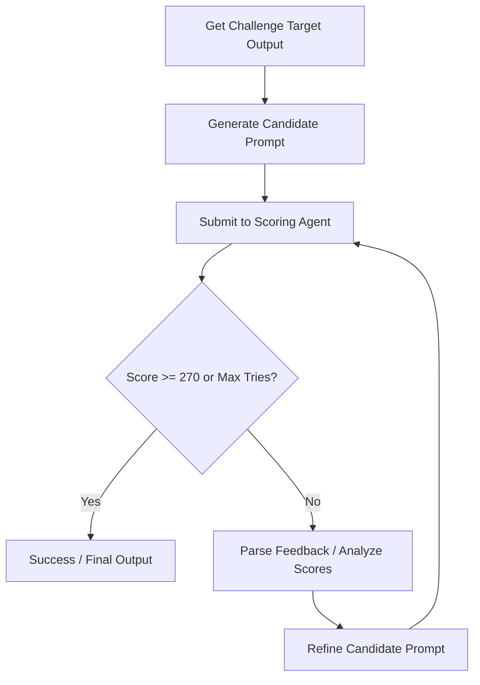
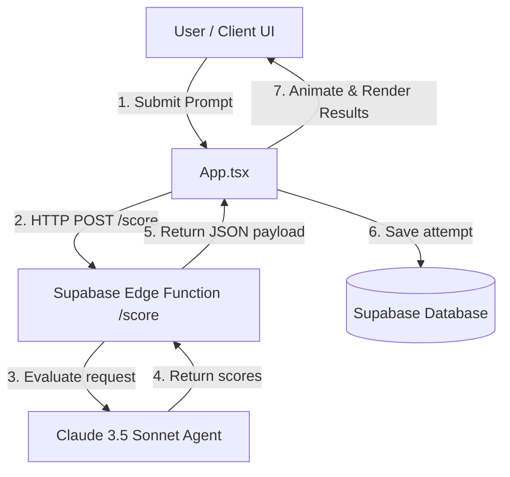

# PromptShot Agents

This document outlines the AI agent architecture in **PromptShot**. It explains how AI agents are used to evaluate user attempts (Scoring) and how developers can build autonomous agents using the **Google Antigravity SDK** to play and master the game.

---

## 1. Backend Scoring Agent (Evaluation)

The PromptShot game server delegates the scoring of user prompts to an LLM agent. 

* **Model**: Claude 3.5 Sonnet (`claude-sonnet-4-20250514`)
* **Endpoint**: Hosted as a Supabase Edge Function (`/functions/v1/make-server-488928a2/score`)
* **Implementation**: Defined in [supabase/functions/server/index.tsx](file:///Users/smriti/Documents/GitHub/promptshot/supabase/functions/server/index.tsx)

### Evaluation Metrics
The scoring agent evaluates three core dimensions of prompt engineering, scoring each from `0-100`:

1. **Accuracy (0-100)**: Measures how well the candidate prompt captures the required content, meaning, and semantic nuances of the target output.
2. **Format (0-100)**: Evaluates whether the prompt correctly enforces the structural constraints, length limits, styling, and output type specified in the target.
3. **Brevity (0-100)**: Evaluates prompt efficiency. Shorter prompts receive higher scores (100 points for prompts under 60 characters, scaling down to 20 points for prompts over 300 characters).

### API Output Schema
The scoring agent returns a structured JSON payload detailing the score breakdown along with resource usage estimation:

```json
{
  "accuracy": 85,
  "format": 90,
  "brevity": 65,
  "total": 240,
  "waterMl": 10,
  "co2Grams": 0.1
}
```

---

## 2. Autonomous Solver Agent (Player)

Using the **Google Antigravity SDK**, you can build an autonomous agent to play PromptShot. This agent acts as a solver, utilizing a feed-forward evaluation loop. It receives the target output and uses its reasoning capabilities to iteratively refine the prompt based on the feedback returned from the scoring endpoint.



### Python SDK Integration Example

Below is a complete implementation of a PromptShot Solver Agent using the Google Antigravity SDK. It defines custom tools to fetch the active challenge and submit score requests, and configures an agent that iteratively refines its prompts.

```python
import asyncio
import aiohttp
from google.antigravity import Agent, LocalAgentConfig, ToolContext

# Define configuration constants
SUPABASE_FUNCTIONS_URL = "https://fvtaoeunqeqnuotydrtv.supabase.co/functions/v1/make-server-488928a2"

# ---------------------------------------------------------
# Custom Tools for the Solver Agent
# ---------------------------------------------------------

async def get_challenge_target_output(difficulty: str) -> str:
    """Fetches the target output for today's active PromptShot challenge.

    Args:
        difficulty: The level of the challenge, e.g., 'BEGINNER', 'INTERMEDIATE', or 'ADVANCED'.
    """
    # Note: In a real-world integration, this connects to the Supabase client or DB
    # For local/testing purposes, we target the main beginner challenge target
    return (
        "Write a Python function called `factorial` that calculates the factorial "
        "of a number recursively. Include a docstring, type hints, and handle "
        "negative inputs by raising a `ValueError`."
    )

async def submit_prompt_attempt(user_prompt: str, target_output: str, ctx: ToolContext) -> str:
    """Submits a candidate prompt to the scoring agent and returns the score breakdown.

    Args:
        user_prompt: The prompt you want to test.
        target_output: The expected output that needs to be generated.
    """
    url = f"{SUPABASE_FUNCTIONS_URL}/score-guest"
    payload = {
        "userPrompt": user_prompt,
        "targetOutput": target_output,
        "idealPrompt": "Write recursive Python factorial function with docstring, types, and ValueError exception for negative input."
    }

    try:
        async with aiohttp.ClientSession() as session:
            async with session.post(url, json=payload) as response:
                if response.status == 200:
                    data = await response.json()
                    # Store history in agent context state
                    history = ctx.get_state("attempts", [])
                    history.append({"prompt": user_prompt, "scores": data})
                    ctx.set_state("attempts", history)
                    
                    return (
                        f"Attempt Submitted!\n"
                        f"- Accuracy: {data.get('accuracy')}/100\n"
                        f"- Format: {data.get('format')}/100\n"
                        f"- Brevity: {data.get('brevity')}/100\n"
                        f"- Total Score: {data.get('total')}/300"
                    )
                else:
                    return f"Error: Received status code {response.status} from scorer."
    except Exception as e:
        return f"Failed to connect to scoring endpoint: {str(e)}"

# ---------------------------------------------------------
# Agent Orchestration
# ---------------------------------------------------------

async def main():
    # Setup configuration with Gemini 3.5 Flash and register tools
    config = LocalAgentConfig(
        model="gemini-3.5-flash",
        tools=[get_challenge_target_output, submit_prompt_attempt],
        system_instructions=(
            "You are an expert Prompt Engineer and an autonomous PromptShot solver agent. "
            "Your objective is to find a prompt that generates the target output with the highest "
            "possible score (aim for at least 270/300 total). "
            "\n\n"
            "Follow this execution flow:\n"
            "1. Retrieve the target output using `get_challenge_target_output`.\n"
            "2. Formulate an initial candidate prompt. Focus on describing details, layout, and constraints precisely.\n"
            "3. Submit the candidate prompt using `submit_prompt_attempt`.\n"
            "4. Analyze the returned score breakdown. If Accuracy or Format are low, add details to guide content/structure.\n"
            "   If Brevity is low, refactor the prompt to be more concise while preserving essential directives.\n"
            "5. Iterate until you achieve a score >= 270 or complete 5 attempts."
        )
    )

    print("Initializing PromptShot Solver Agent...")
    async with Agent(config=config) as agent:
        # Initiate the prompt engineering loop
        response = await agent.chat(
            "Solve today's BEGINNER PromptShot challenge. Begin by fetching the challenge target output."
        )
        
        # Stream the agent's reasoning and step progress
        async for chunk in response:
            print(chunk, end="", flush=True)
        print()

if __name__ == "__main__":
    asyncio.run(main())
```

---

## 3. How to Run the Solver Agent

1. **Set Up Python Environment**:
   Ensure you have Python 3.10+ installed. Install the `google-antigravity` package along with dependencies:
   ```bash
   pip install google-antigravity aiohttp
   ```

2. **Configure API Credentials**:
   To authenticate the Antigravity SDK with Gemini, set the environment variable:
   ```bash
   export GEMINI_API_KEY="your-gemini-api-key"
   ```
   *(You can obtain a key from [Google AI Studio](https://aistudio.google.com/app/api-keys))*

3. **Execute the Script**:
   Save the solver code as `solve_promptshot.py` and run it:
   ```bash
   python solve_promptshot.py
   ```

---

## 4. How This Repository Works

PromptShot is structured as a modern web application consisting of a React + TypeScript frontend and a Supabase backend. The core components and data flows are organized as follows:



### Frontend Architecture
- **State-Driven Navigation**: The client UI is managed within [App.tsx](file:///Users/smriti/Documents/GitHub/promptshot/src/app/App.tsx) using a single `gameState` enum (no routing framework).
- **Styling & Theme**: Styling is defined in [theme.css](file:///Users/smriti/Documents/GitHub/promptshot/src/styles/theme.css) using a dark forest green background (`#0B1610`) and mint green accent (`#6EE09B`). It enforces Tailwind CSS v4 variables mapped to OKLCH colors.
- **Client Supabase Integration**: Streak and user authentication are handled asynchronously using the client libraries in [streak.ts](file:///Users/smriti/Documents/GitHub/promptshot/src/lib/streak.ts) and the shared supabase credentials.

### Backend Architecture
- **Supabase Edge Functions**: Defined under the [supabase/functions/server/](file:///Users/smriti/Documents/GitHub/promptshot/supabase/functions/server) directory.
- **Scoring Logic**: Implemented in [index.tsx](file:///Users/smriti/Documents/GitHub/promptshot/supabase/functions/server/index.tsx), using the Hono framework running on Deno. It securely queries Claude 3.5 Sonnet to obtain prompt engineering scores.
- **KV Store**: A simple key-value database interface is provided in [kv_store.tsx](file:///Users/smriti/Documents/GitHub/promptshot/supabase/functions/server/kv_store.tsx) for storing and fetching configuration details.

---

## 5. Skill Routing & Required Custom Skills

When development agents (such as Antigravity) operate on this repository, their task executions must be routed through specific skills depending on the target components:

### Built-in Skill Routing
- **`modern-web-guidance`**: Must be activated first for all HTML/CSS styling, animations, modal transitions, and React hook updates.
- **`chrome-devtools`**: Activated when debugging client-side rendering issues, inspecting HTTP payloads sent to the scorer, or analyzing performance metrics.

### Required Custom Skills
For tasks involving database management and edge functions, agents must utilize the following custom skills:
- **`supabase-management`**: Exposes operations to deploy/migrate database schema changes for tables like `challenges`, `scores`, and `profiles`.
- **`deno-edge-functions`**: Handles Deno runtime environment setups, local serving via `supabase functions serve`, and deployment via the Supabase CLI (`supabase functions deploy server`).

---

## 6. Knowledge Architecture

The repository's design systems, states, and constraints are documented under the [guidelines/](file:///Users/smriti/Documents/GitHub/promptshot/guidelines) directory:

- **Core Guidelines**: [Guidelines.md](file:///Users/smriti/Documents/GitHub/promptshot/guidelines/Guidelines.md) describes the tone, 5-state machine, and overall product specifications.
- **Tech Stack & Setup**: [setup.md](file:///Users/smriti/Documents/GitHub/promptshot/guidelines/setup.md) lists instructions for installing packages, configuring local mocks, and database schemas.
- **Design Foundations**:
  - **Color Tokens**: [colors.md](file:///Users/smriti/Documents/GitHub/promptshot/guidelines/foundations/colors.md) details the near-black canvas theme and how colors must be strictly partitioned (Amber for scoring, Mint/Teal for environmental impact).
- **Component Catalog**: [overview.md](file:///Users/smriti/Documents/GitHub/promptshot/guidelines/components/overview.md) lists the interactive components, with specific layout specs for components like [bullseye.md](file:///Users/smriti/Documents/GitHub/promptshot/guidelines/components/bullseye.md), [impact-card.md](file:///Users/smriti/Documents/GitHub/promptshot/guidelines/components/impact-card.md), and [learn-panel.md](file:///Users/smriti/Documents/GitHub/promptshot/guidelines/components/learn-panel.md).

---

## 7. Working Rules

Every developer and agent modifying this repository must strictly adhere to the following rules:

1. **Strict Theme Isolation**: 
   - Never mix colors outside the system. Amber (`#F59E0B`) is reserved exclusively for scoring elements. Mint/Teal (`#6EE09B`/`#14B8A6`) is reserved for environmental impact elements.
2. **Typography Constraints**:
   - Headers/wordmarks must use **Space Grotesk**.
   - Input and code elements must use **JetBrains Mono**.
3. **State Machine Integrity**:
   - The app must use the single `gameState` enum for transitions: `challenge` $\to$ `loading` $\to$ `results` $\to$ `impact` $\to$ `already-played`. Do not bypass the state machine with routers or overlays.
4. **Mobile-First Layout**:
   - Viewports must be optimized at `390px` width. Large display viewports must center content with a maximum width of `480px`.
5. **No Box Shadows or Gradients**:
   - Except for focused input elements (which use a `0 0 0 2px` Amber glow at 40% opacity), box-shadows and gradients are strictly prohibited.

