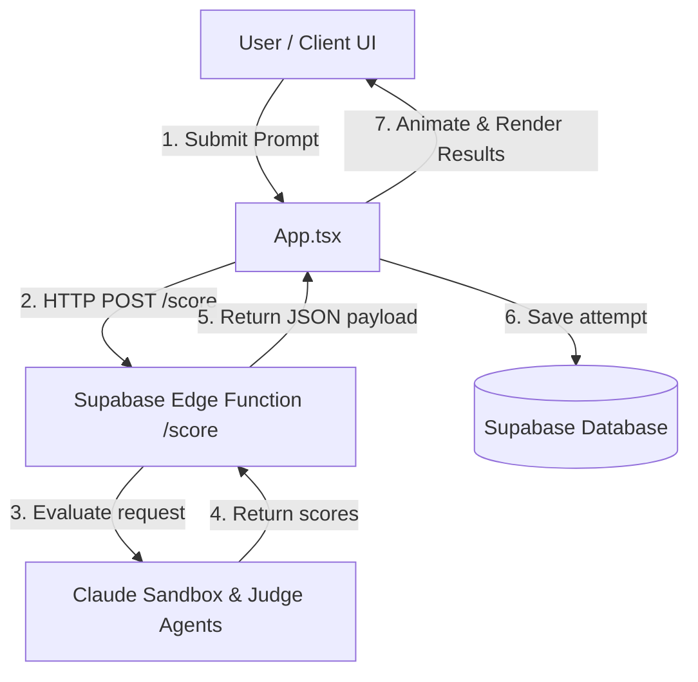

# PromptShot Agents Overview

This document outlines the AI agent architecture in **PromptShot**. It covers both evaluation (scoring attempts) and automation (solver agents).

---

## 1. Repository Data Flow

PromptShot is structured as a React + TypeScript frontend and a Supabase backend. The core components and data flows are organized as follows:

---

## 2. Skill Routing & Custom Skills

When development agents (such as AI coding assistants) operate on this repository, their task executions must be routed through specific skills depending on the target components:

### Built-in Skill Routing
- **`modern-web-guidance`**: Must be activated first for all HTML/CSS styling, animations, modal transitions, and React hook updates.
- **`chrome-devtools`**: Activated when debugging client-side rendering issues, inspecting HTTP payloads sent to the scorer, or analyzing performance metrics.

### Required Custom Skills
For database and edge function changes:
- **`supabase-management`**: Exposes operations to deploy/migrate database schema changes for tables like `challenges`, `scores`, and `profiles`.
- **`deno-edge-functions`**: Handles Deno runtime environments, local serving, and CLI deployment.

---

## 3. Working Rules
Every developer and agent modifying this repository must strictly adhere to the following rules:

1. **Strict Theme Isolation**: Never mix colors outside the system. Amber (`#F59E0B`) is reserved for scoring. Mint/Teal (`#6EE09B`/`#14B8A6`) is reserved for environmental impact.
2. **Typography Constraints**: Headers/wordmarks must use **Space Grotesk**. Input and code elements must use **JetBrains Mono**.
3. **State Machine Integrity**: App must use a single `gameState` enum for transitions: `challenge` $\to$ `loading` $\to$ `results` $\to$ `impact` $\to$ `already-played`. No routers or overlays.
4. **Mobile-First Layout**: Viewports optimized at `390px` width (max-width `480px` centered on larger screens).
5. **No Box Shadows or Gradients**: Except for focused inputs which use a `0 0 0 2px` Amber glow at 40% opacity, shadows and gradients are prohibited.

---

## 4. Sub-Module References

* [Backend Scoring Agent (Evaluation)](scoring.md)
* [Autonomous Solver Agent (Player)](solver.md)
