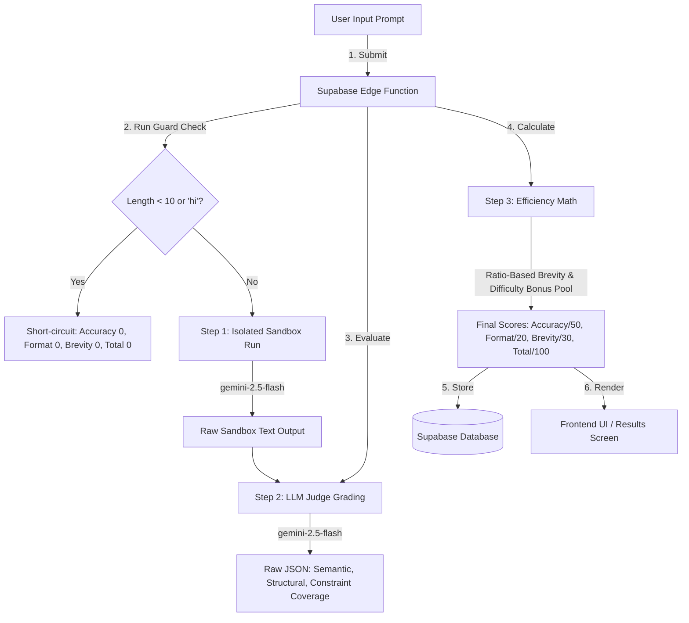

# Evaluation Pipeline Overview

PromptShot separates **execution** (running the prompt) from **evaluation** (grading the output). This prevents "jailbreak" attempts where a player instructs the LLM to skip grading or copy-paste the target.

---

## 1. Execution Flow

The system processes attempts as a three-step pipeline:

---

## 2. Guard Checks & Relevance Validation

To protect system resources and prevent wasting LLM tokens on garbage inputs, the edge function runs an immediate guard check:

* **Short Inputs/Greetings**: Input length $< 10$ characters, or matches common conversational words (`"hi"`, `"hello"`, `"test"`, `"hey"`, `"prompt"`).
* **Plagiarism Guard / Copy-Paste check**: If a player copies/pastes the target output (word overlap $> 60\%$), they receive a `0` score.
* **Behavior**: If either check triggers, the pipeline short-circuits. No LLM calls are made.
* **Returned Score**: 
  - **Accuracy**: `0`
  - **Format**: `0`
  - **Brevity**: `0`
  - **Total**: `0 / 100`

---

## 3. Score Mapping & Storage

To align the 100-point rubric with the database schema, scores are mapped into the `scores` table as follows:

| Database Column | Scored Component | Score Range | Description |
| :--- | :--- | :--- | :--- |
| `accuracy` | Semantic + Constraint Coverage | 0–50 pts | Content accuracy and constraint coverage details |
| `format` | Structural Match | 0–20 pts | Layout matching (lists, tables, code) |
| `brevity` | Green Efficiency | 0–30 pts | Token economy compared to ideal baseline |
| **`total`** | **Total Score** | **0–100 pts** | **Sum of above, adjusted by difficulty bonus pool** |

* **Difficulty Adjustment**: The final sum adds flat bonus points based on difficulty: `BEGINNER` (+0), `PRO` (+5), or `EXPERT` (+10), capped at `100`.

---

## 4. Sub-Module References

For detailed specifications, see:
* [Sandbox Execution Detail](sandbox.md)
* [LLM Judge Scoring Rubric](judge.md)
* [Brevity & Resource Footprint Math](efficiency.md)
* [Scientific Citations & Methodology Guide](../methodology.md)

